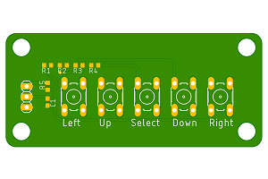

# Analog-Switch-Board
Switch board for using on a analog pin





## Code
```C++
int LCD_State_Machine_San::read_LCD_buttons()
{
    adc_key_in = analogRead(0);

    if (adc_key_in > 1000) return btnNONE;
    if (adc_key_in < 50) return btnRIGHT;
    if (adc_key_in < 195) return btnUP;
    if (adc_key_in < 380) return btnDOWN;
    if (adc_key_in < 555) return btnLEFT;
    if (adc_key_in < 790) return btnSELECT;

    return btnNONE;   
}
```
